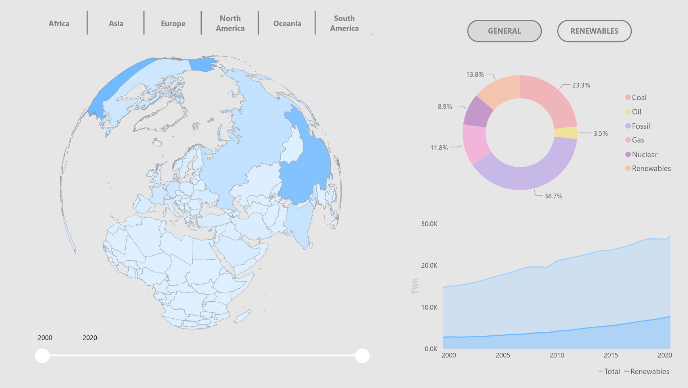

# Geokrum

## Overview

A production data science platform processing planetary data

## Prerequisites

- [Git](https://git-scm.com/downloads)
- [Conda](https://www.anaconda.com/download/success)
- [Docker](https://docs.docker.com/desktop/setup/install)
- [Terraform](https://developer.hashicorp.com/terraform/install)

## Installation

1. **Clone the repository**

   ```bash
   git clone https://github.com/bepnga/geokrum.git
   cd geokrum
   ```

2. **Set up the environment**

   ```bash
   conda env create -f environment.yml
   conda activate geok
   ```

3. **Set up environment variables**

   Create an IAM user with S3 access at [AWS](https://aws.amazon.com/), generate a PAT in your workspace at [Databricks](https://databricks.com/) and set up the [API](https://www.kontur.io/solutions/event-feed/api-access/) token (*optional: use a cloud Kafka broker*)

   ```bash
   cp .env.example .env
   ```

   Edit .env with your credentials
   
   ```bash
   source .env
   ```

4. **Initialize the pipeline**

   ```bash
   cd deployment
   docker compose up -d
   ```

   Wait until Airflow is available at http://localhost:8080

5. **Provision cloud infrastructure**

   ```bash
   cd infra
   terraform init
   terraform apply
   ```

## Usage

Soon...

[](https://app.powerbi.com/view?r=eyJrIjoiOTYyYWE5ZjEtNGM0Yi00YmE1LWFiNzgtMjBiYzMxOWY5YmFkIiwidCI6IjUzZDc2Y2UwLTBkNTMtNGJiYy1iZjQ2LTE0ZTdiNGJmMzJhMiIsImMiOjl9)

*Click to interact with the preview dashboard.*

## Contributing

Please submit a pull request. For major changes, please open an issue first for discussion.

## License

This project is licensed under the MIT License. See the [LICENSE](LICENSE) for details.

## Contact

For questions or feedback, please contact at jodel@tuta.com.
